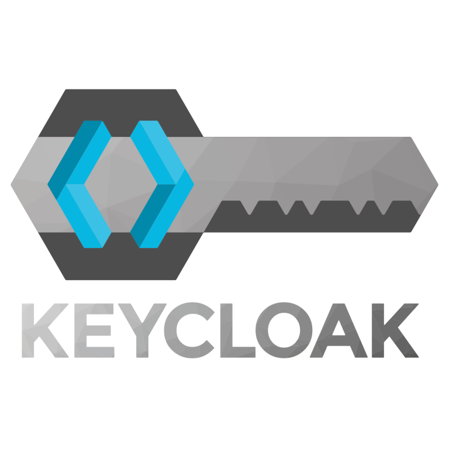
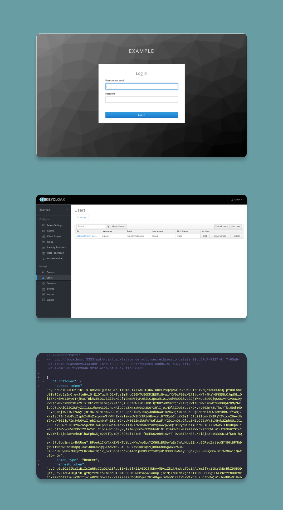

  

  Simple System for Authentication and Authorization using Keycloak.

  <a href="#technologies">Technologies</a>&nbsp;&nbsp;&nbsp;|&nbsp;&nbsp;&nbsp;
  <a href="#license">License</a>

## Technologies

Technologies I used to develop this system

- [Golang](https://golang.org/)
- [OAuth](https://oauth.net/2/)
- [Keycloak](https://www.keycloak.org/)
- [Docker](https://www.docker.com/)

## License

This project is licensed under the MIT License - see the [LICENSE](LICENSE) file for details.

---

Made by Hugo Souza 👋